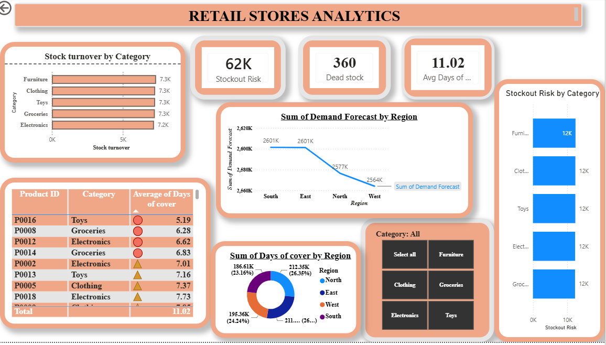

# Retail Inventory Forecasting & Stockout Risk Analysis

## Project Overview
This project addresses critical supply chain disruptions by evaluating retail inventory datasets to forecast stockout vulnerabilities, isolate dead stock items, and establish data-driven replenishment priority frameworks.

## Core Analytics & Framework Metrics
* **Days of Cover:** Computes current stock velocity and runway: `Current Inventory / Average Daily Sales`.
* **Stockout Risk Criteria:** Automatically flags individual item SKUs dropping below 7 Days of Cover.
* **Dead Stock Identification:** Isolates inventory assets tracking zero sales units over a rolling 60-day window.
* **Dynamic Replenishment:** Establishes a triage priority metric using automated traffic-light visual logic.

## Interactive Analytics Dashboard

## Repository Contents
* **Power BI Workbook (.pbix):** Contains the fully interactive operational data model, synced slicing planes, and conditional metric calculations.
* **Excel Data Sheet (.xlsx):** Core transformation sheets tracking baseline metrics.
* **SQL Pipeline Scripts (.sql):** Analytical queries mapping target inventory velocity thresholds.
